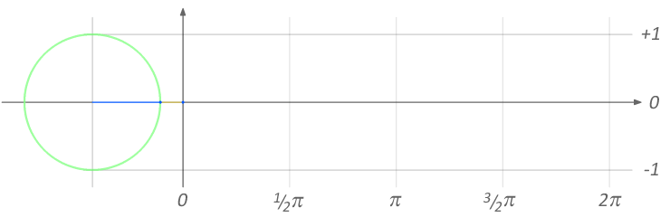
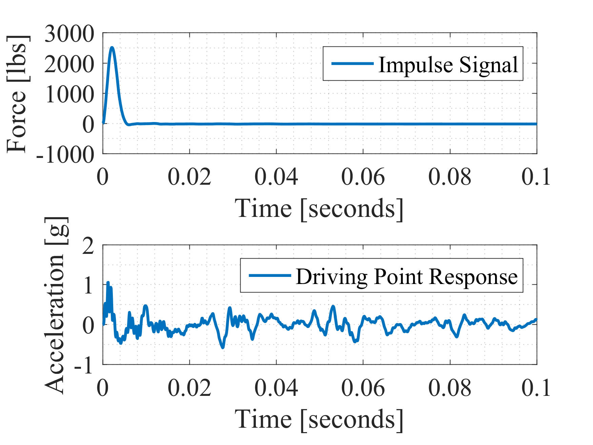
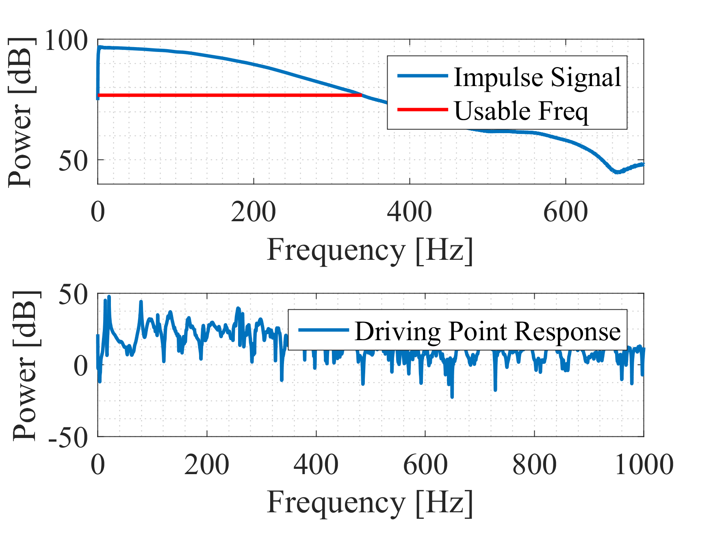

# vibs

This repository is a collection of notes, signal processing tools, and examples related to structural dynamics.

{width=50%}

# References

## Allemang's Notes

The following are course notes written by Dr. Randall J. Allemang of the Structural Dynamics Research Laboratory (SDRL) of the University of Cincinnati. They are the thoughtful explanation of much of the seminal work in experimental modal analysis and are an invaluable resource.

* [Vibrations II: Analytical and Experimental Modal Analysis](docs/allemangs-notes/UC Mechanical Vibrations II.pdf)

* [Vibrations III: Experimental Modal Analysis](docs/allemangs-notes/UC Mechanical Vibrations III.pdf)

## Frank's Notes
Class notes from CIVE801 and CIVE802 taught by Frank Moon at Drexel University. Note that the PDF's are linked here, but there is also interactive spreadsheets within the repository which demonstrate the theory.

### SDOF (from CIVE801)

* [Lecture 1 - Introduction to Structural Dynamics](docs/franks-notes/sdof/Lecture 1 - Introduction to Structural Dynamics.pdf)

* [Lecture 2 - Dynamic Modeling (Point Mass)](docs/franks-notes/sdof/Lecture 2 - Dynamic Modeling (Point Mass).pdf)

* [Lecture 3 - Dynamic Modeling (Distributed Mass)](docs/franks-notes/sdof/Lecture 3 - Dynamic Modeling (Distributed Mass).pdf)

* [Lecture 4 - EOM and Undamped Free Vibration](docs/franks-notes/sdof/Lecture 4 - EOM and Undamped Free Vibration.pdf)

* [Lecture 5 - Damped Free Vibration](docs/franks-notes/sdof/Lecture 5 - Damped Free Vibration.pdf)

* [Lecture 6 - Forced Harmonic Vibration](docs/franks-notes/sdof/Lecture 6 - Forced Harmonic Vibration.pdf)

* [Lecture 7 - Forced Harmonic and General Loading](docs/franks-notes/sdof/Lecture 7 - Forced Harmonic and General Loading.pdf)

* [Lecture 8 - General Loading and Numerical Methods](docs/franks-notes/sdof/Lecture 8 - General Loading and Numerical Methods.pdf)

### MDOF (from CIVE802)

* [Lecture 1 - Formulation of EOM for MDOF Systems I](docs/franks-notes/mdof/Lecture 1 - Formulation of EOM for MDOF Systems I.pdf)

* [Lecture 2 - Formulation of EOM for MDOF Systems II](docs/franks-notes/mdof/Lecture 2 - Formulation of EOM for MDOF Systems II.pdf)

* [Lecture 3 - Formulation of EOM for MDOF Systems III](docs/franks-notes/mdof/Lecture 3 - Formulation of EOM for MDOF Systems III.pdf)

* [Lecture 4 - Normal Mode Method and Free Vibrations](docs/franks-notes/mdof/Lecture 4 - Normal Mode Method and Free Vibrations.pdf)

* [Lecture 5 - Classical Damping](docs/franks-notes/mdof/Lecture 5 - Classical Damping.pdf)

* [Lecture 6 - Forced Vibration Modal Analysis](docs/franks-notes/mdof/Lecture 6 - Forced Vibration Modal Analysis.pdf)

## Examples

Example files are located in the vibs/examples/ directory. Any data files referenced in the examples are located in the vibs/data/ directory.

The following example descriptions are paraphrased from the comments in each example.m file. Refer to the specific example for more details.

>Run the `init.m` function (from any working directory) to add all the project contents to the Matlab search path.

### FFT Scaling

`fft_example1.m` shows the basics of forming time signals based on the amplitude and frequency of two sinusoids. The frequency content is found via the FFT and the proper scaling is recovered.

### Usable Frequency Content of Impulse Signal

`impulse_example1.m` loads an impact record (force and driving point) from a file.

{width=50%}

The usable frequency content of the impulse signal is found and plotted with the driving point frequency content.

{width=50%}
