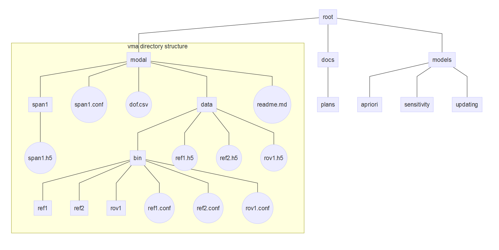

# Directory Structure

{width=100%}

# Configuration Files

Simple configuration files are used to set user preferences and control the behavior of different processes.

The general syntax is:

```
# Comment
VARIABLE    value
```
Where there is a tab delimination between `VARIABLE` and `value`.

## Root VMAIO Config

The main configuration file is expected to be on the modal/ root folder and named `config` (with no extension).

    # VMA MAIN Configuration File
    # Version 0.1.0

    DATA_DIR                    data

    STRUCTURE_NO                123456789
    STRUCTURE_DESCRIPTION       Bridge 4

    USER_NAME                   John
    USER_EMAIL                  john@email.com


## Data Acquisition Config

DAQ configuration files are assumed to be in the path: `~/data/bin/<daq_name>.conf`. Note the `.conf` extension.

DAQ's can be utilized in one of two modes, trigger or logger.

### Trigger Mode

DAQ's in trigger mode are expected to have **1** input record per file. The files are expected to have the naming convention: `somethingsomething_<fileid>_<avg>`

Below is an example of a trigger configuration file:

    # VMA DAQ Configuration
    # Version 0.1.0

    # daq scanning mode
    MODE        trigger

    # daq sampling info
    FS          3200
    BLOCKSIZE   3200

    # trigger window
    LB          50
    RB          31950

    # daq channel to data column mapping. the time stamp column is zero indexed to avoid confusion with the physical daq channels
    TIMEID      0
    INID        1, 2, 3
    OUTID       4
    TRIGGERID   1

    # units per channel
    UNITS             lb, lb, lb, g
    # channel scalling mv/v -> EU
    SENSITIVITY       .25, .25, .25, 1000
    # scaled already? boolean
    SCALED      0


### Logger Mode

DAQ's in logger mode are exected to have a series of files saved in a named folder.

Below is an example of a logger configuration file:

    # VMA DAQ Configuration
    # Version 0.1.0

    # daq scanning mode
    MODE        logger

    # daq sampling info
    FS          3200
    BLOCKSIZE   3200

    # daq channel to data column mapping. the time stamp column is zero indexed to avoid confusion with the physical daq channels
    TIMEID      0
    OUTID       1, 2, 3, 4, 5, 6

    # units per channel
    UNITS       g, g, g, g, g, g
    # channel scalling mv/v -> EU
    SENSITIVITY 1000, 1000, 1000, 1000, 1000, 1000
    # scaled already? boolean
    SCALED      0


## Global Degree-of-Freedom File

The global DOF file is used to map the fileids (recorded in the filename by a trigger DAQ) to the global DOF in the modal model. It is expected to be a comma deliminated table located on the project root and named `dof.csv`.

Below is an example of a dof configuration file. Note the `channel = -1` in the last four rows signals that all force channels for that DAQ are to sum.

    id,record,axis,orientation,daq,type,channel,x,y,z,input,output
    1,0,3,1,ref2,fixed,1,10,0,0,0,1
    2,0,3,1,ref2,fixed,2,20,0,0,0,1
    3,0,3,1,ref2,fixed,3,60,0,0,0,1
    7,0,3,1,ref1,fixed,1,8.28,40,0,0,1
    8,0,3,1,ref1,fixed,2,18.28,40,0,0,1
    9,0,3,1,ref1,fixed,3,68.28,40,0,0,1
    13,1,3,1,rov1,roving,-1,8.53,5,0,1,1
    14,2,3,1,rov1,roving,-1,18.53,5,0,1,1
    15,3,3,1,rov2,roving,-1,28.53,5,0,1,1
    16,4,3,1,rov2,roving,-1,58.53,5,0,1,1
